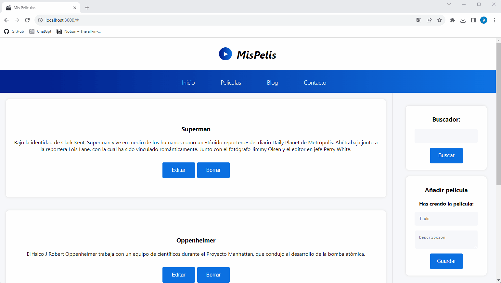

# App de Películas

## Tecnologías utilizadas

   

## Tabla de contenidos

- [Descripción del proyecto :bulb:](#Descripción-del-proyecto)
- [Acceso⛏️](#Acceso)
- [Desarrollo 🪛](#Desarrollo)
- [Estado Actual :white_check_mark:](#Estado)
- [Desarrolladores del Proyecto :raising_hand:](#Desarrolladores-del-Proyecto)
- [Contribuyentes y agradecimiento :clap:](#Contribuyentes-y-agradecimiento.)
- [Licencia :vertical_traffic_light:](#Licencia)
- [Conclusiones :tada:](#Conclusiones)
- [Contacto ::calling::](#Contacto)

### Descripción del proyecto

En este proyecto, a modo de práctica, se crea una aplicación en donde el usuario puede incluir títulos de películas junto con su descripción correspondiente.
Además, se genera la funcionalidad de poder editar, borrar y buscar las películas de la lista.

### Acceso

El lanzamiento es muy sencillo, y si lo prefieres puedes descargar el código para ejecutarlo en local.

### Desarrollo

Basándome en un videotutorial y a modo de práctica, logro la funcionalidad de este proyecto. El mismo es realizado de acuerdo a los retos propuestos por un curso tomado en línea.

Primero se realiza la maquetación completa con **HTML** y **CSS**, luego se inicia el proyecto de **React** y se inicia la desestructuración del código, para lo cual se crean diversos componentes y helpers. 
Además, se aplican eventos, elementos y funcionalidad con **JavaScript**.

En la imagen siguiente se observa el estado inicial vs. el proyecto acabado. 

### Estado Actual

### Desarrolladores del Proyecto

Este proyecto ha sido realizado únicamente por mí, teniendo como guía un curso de: 

### Contribuyentes y agradecimiento

Gracias a los colegas de este mundillo por brindar sus conocimientos a los nuevos.

### Licencia

Sin licencia aplicada.

### Conclusiones 

Listo y a por el siguiente proyecto.

### Contacto
<a href = "mailto:gonllat@gmail.com"> 
